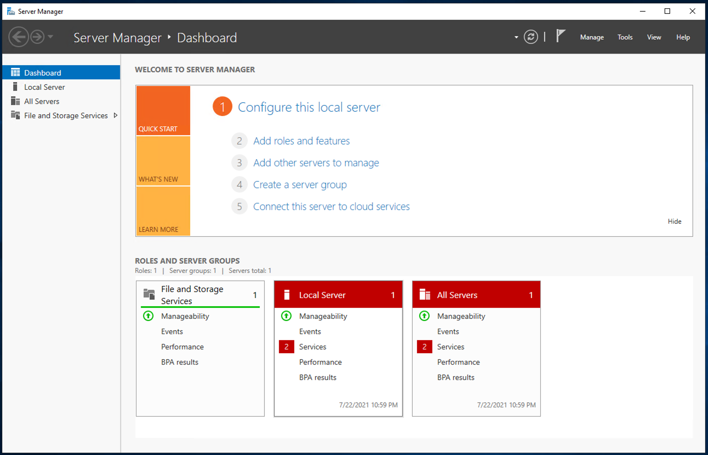

# **07. Setup Windows Active Directory Service**

1. init 
  -  
    - 
      -  

          cat <<EOF> ~/ansible-playbooks/dirdir/playbookfile.yml
          # playbookfile.yml
          ---
          - hosts: ETCD-1
            become: true

        </img> 