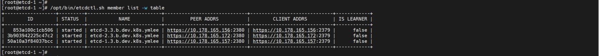

# **11. External etcd Installation**

- Air-Gap Environment
- etcdadm was made and ready in the Bastion server
- Get the installation files and package from the Bation(ansible) server
- Target External Cluster
  - 3 external etcd nodes 

    | Server | Network | vCPU (core) | RAM (GB) | Internal Disk (GB) | external Disk (GB) |
    | :---: | :---: | :---: | :---: | :---: | :---: |
    | etcd-1 | Private Only | 2 | 4 | 25 | - |
    | etcd-2 | Private Only | 2 | 4 | 25 | - | 
    | etcd-3 | Private Only | 2 | 4 | 25 | - |

- ETCD version : v3.5.0
---

1. Copy etcd files from Bastion to etcd Servers

    1.1. Copy etcdadm and etcd installation files from Bastion
    
    - create ansible playbook

          ansible-playbook -i k8s-cluster-hosts ~/ansible-playbooks/etcd/copy_etcdadm.yml

2. Initialize etcd cluster 
    
    2.1. "Run etcdadm init"

    - with ansible playbook
    
          ansible-playbook -i k8s-cluster-hosts ~/ansible-playbooks/etcd/etcdadm_init.yml

3. Copy cert files

    3.1.from ETCD-1 to ETCD-2,3

    - with ansible playbook

          ansible-playbook -i k8s-cluster-hosts ~/ansible-playbooks/etcd/copy_etcd_cert.yml

4. Build ETCD cluster

    4.1 Join to the ECDD cluster

    - with ansible playbook

          cat <<EOF> ~/ansible-playbooks/etcd/etcdadm_join-${K8S_CLUSTER_SHORT}.yml
          # etcdadm_join-${K8S_CLUSTER_SHORT}.yml
          ---
          - hosts: ETCD-2:ETCD-3
            become: true
            tasks:
              - name: join to etcd cluster
                command:  ~/etcdadm join https://${ETCD_1}:2379
          EOF

          cat ~/ansible-playbooks/etcd/etcdadm_join-${K8S_CLUSTER_SHORT}.yml

          ansible-playbook -i k8s-cluster-hosts ~/ansible-playbooks/etcd/etcdadm_join-${K8S_CLUSTER_SHORT}.yml

5. Check the status (it can be skipped)

    5.1. Check the status of creation

    - check at the etcd server
         
          ssh root@${ETCD_1}

          /opt/bin/etcdctl.sh member list -w table

          exit

      - Check the Result : (Sample)          

      </img> 
---

# **Done**