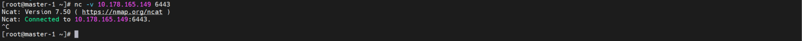

# **130. Setup VMs for Kubernetes Cluster**

- Air-Gap Environment
- Install and configure ...
  - Container Runtime Interface (CRI) : Containerd
  - Kubernetes files : kubelet, kubeadm, kubectl and image for kubernetes
- Get the installation files and package from the ansible/nexus server
- Target K8s Cluster
  - Considering 3 External Etcd nodes 
  - 3 Master nodes, 3+ worker nodes, 3 Router nodes, (2 infra nodes)
  
    | Server | Network | vCPU (core) | RAM (GB) | Internal Disk (GB) | external Disk (GB) |
    | :---: | :---: | :---: | :---: | :---: | :---: |
    | master-1 | Private Only | 4 | 16 | 100 | - |
    | master-2 | Private Only | 4 | 16 | 100 | - |
    | master-3 | Private Only | 4 | 16 | 100 | - |
    | worker-1 | Private Only | 4 | 16 | 100 | - |
    | worker-2 | Private Only | 4 | 16 | 100 | - |
    | worker-3 | Private Only | 4 | 16 | 100 | - |
    | router-1 | Private Only | 4 | 16 | 100 | - |
    | router-2 | Private Only | 4 | 16 | 100 | - |
    | router-3 | Private Only | 4 | 16 | 100 | - |
    | infra-1 | Private Only | 4 | 16 | 100 | - |
    | infra-2 | Private Only | 4 | 16 | 100 | - |

- Containerd Version : Latest  
- Kubernetes Version : v1.20.5

---

1. Setup Configuration

    1.1. Install Linux Netcat to each K8s master server

    - To check the Load Balacer Connectivity

          ansible-playbook -i k8s-cluster-hosts ~/ansible-playbooks/initialize/yum_install_nc.yml

    - make command script for the master server and ssh log in to the master-1

          echo nc -v ${LB_1} 6443

          ssh root@${MASTER_1}

    - Verify the Load Balacer Connectivity
        
          nc -v xxx.xxx.xxx.xxx 6443

          exit

      - Check the Result : (Sample)

      </img> 

    1.2. Copy Configuration file to each server

    - at ansible Server

    - Copy Configuration file to each server

          ansible-playbook -i k8s-cluster-hosts $HOME/ansible-playbooks/initialize/set_yum_repo.yml

2. Install Container Runtime (containerd)

    2.2. Copy CRI configuration to each server

    - Copy CRI configuration to each server

          ansible-playbook -i k8s-cluster-hosts ~/ansible-playbooks/containerd/base_for_containerd.yml

    2.3. Install containerd
    - Install containerd

          ansible-playbook -i k8s-cluster-hosts ~/ansible-playbooks/containerd/install_containerd.yml

    2.4 Modity Containerd Configuration File
    - with ansible plyabooks

          ansible-playbook -i k8s-cluster-hosts ~/ansible-playbooks/containerd/modify_containerd_configuration.yml

    2.5 Start Containerd
    - with ansible plyabooks
          
          ansible-playbook -i k8s-cluster-hosts ~/ansible-playbooks/containerd/start_containerd.yml

         
3. Install Kubernetes package

    3.1 Setup base configuration for Kubernetes
    - with ansible plyabooks

          ansible-playbook -i k8s-cluster-hosts ~/ansible-playbooks/kubernetes/base_for_kubernetes.yml

    3.2 Install Kubernetes
    - with ansible plyabooks    

          ansible-playbook -i k8s-cluster-hosts ~/ansible-playbooks/containerd/install_kubernetes.yml

    3.3. Systemd Configuration
    - with ansible plyabooks    

          ansible-playbook -i k8s-cluster-hosts ~/ansible-playbooks/kubernetes/modify_systemd_configuration.yml

4. Restart kubelet

    4.1  Restart kubelet
    - with ansible plyabooks 

          ansible-playbook -i k8s-cluster-hosts ~/ansible-playbooks/kubernetes/restart_kubelet.yml

---
