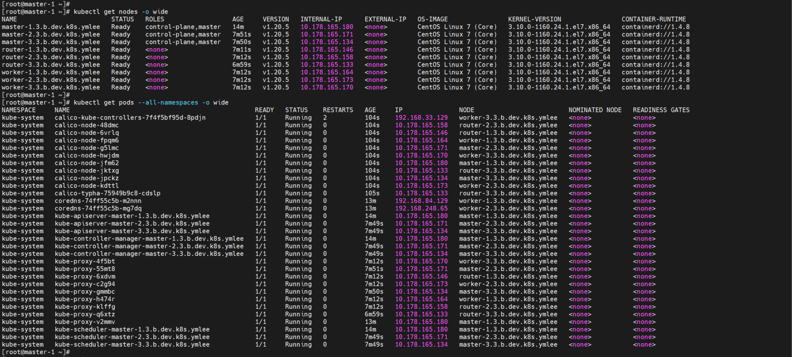

# **16-2. Apply CNI Calico (Typha)**

- Air-Gap Environment
- Apply Calico with Typha configuration
  - Typha supports large number of worker nodes (50+)
  - 3 master nodes, 3 worker nodes, 3 router nodes, (2 infra nodes)
- To make router node to be the typha node, set label first
- Calico Version : Latest ?

--- 

1. Set node label for typha node

    1.1 Cooy label script to master-1   
    - copy the file and run

          ansible-playbook -i k8s-cluster-hosts ~/ansible-playbooks/kubernetes/copy_kubectl_label_sh.yml

2. Prepare the Calico-typha.yaml

    2.1 Edit the Calico.yaml
    - Edit the calico-typha yaml to assign the typha to the router nodes

          vi ~/files/BASTION-0/calico/calico-typha.yaml
          
      - Insert value "node-type: router" into Deployment "calico-typha.spec.template.spec.nodeSelect"

            ...

            apiVersion: apps/v1
            kind: Deployment
            metadata:
              name: calico-typha
              namespace: kube-system
              labels:
                k8s-app: calico-typha
            spec:
            ...
              template:
                ...
                spec:
                  nodeSelector:
                    kubernetes.io/os: linux
                    node-type: router
                  ...

    2.2 Copy the Calico-typha.yaml to master-1 Server
    - to the master-1

          ansible-playbook -i k8s-cluster-hosts ~/ansible-playbooks/calico/copy_calico_typha.yml

    2.3 apply calico_typha yaml   
    - apply

          ansible-playbook -i k8s-cluster-hosts ~/ansible-playbooks/calico/apply_calico_typha_yaml.yml

    2.4 Check the K8s cluster installation

    - Verify all nodes is ready and all container is running status

          ssh root@${MASTER_1}

          kubectl get nodes -o wide

          kubectl get pods --all-namespaces -o wide

          exit

      - Check the Result : (Sample)

      </img> 
