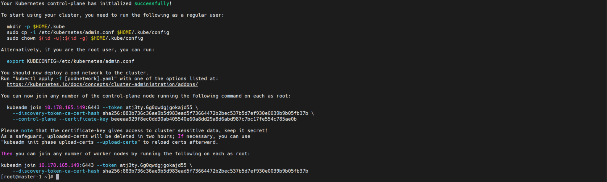
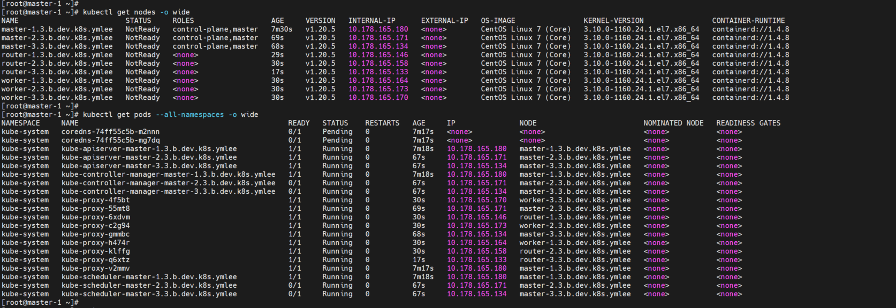

# **15. Create K8s Cluster with Kubeadm init**

- Air-Gap Environment
- Run kubeadm init command in the master-1 server
- get the join 
- make parameter for master node join and worker node join
- Run the rest join commnad with anisible playbooks

1. kubeadm init to make a kubernetes cluster 
  
    1.1 Run the kubeadm init command at the master-1 node
    
    - move to the master-1 node
      
          ssh ${MASTER_1}
    
    - Runte the kubeadm init command 

          kubeadm init --config kubeadm-config.yaml --upload-certs

      - Check the Result : (Sample)

      </img> 

    - Baak to the ansible Server

          exit

    1.2 Prepare k8s cluster join paremeters and cert files 

    - Make the parameters to join with the above result

          export KUBEADM_JOIN_MASTER="kubeadm join xxx.xxx.xxx.xxx:6443 --token xxxxxxxxxxxxxxxxxxxxxx --discovery-token-ca-cert-hash sha256:xxxxxxxxxxxxxxxxxxxxxxxxxxxxxxxxxxxxxxxxxxxxxxxxxxxxxxxxxxxxxxxx --control-plane --certificate-key xxxxxxxxxxxxxxxxxxxxxxxxxxxxxxxxxxxxxxxxxxxxxxxxxxxxxxxxxxxxxxxx"
          
          export KUBEADM_JOIN_WORKER="kubeadm join xxx.xxx.xxx.xxx:6443 --token xxxxxxxxxxxxxxxxxxxxxx --discovery-token-ca-cert-hash sha256:xxxxxxxxxxxxxxxxxxxxxxxxxxxxxxxxxxxxxxxxxxxxxxxxxxxxxxxxxxxxxxxx"

    - copy certs to master2,3

          ansible-playbook -i k8s-cluster-hosts-${K8S_CLUSTER_SHORT} ~/ansible-playbooks/kubernetes/copy_kubernetes_certs.yml

    1.3 Create ansible playbooks to execute K8s Cluster join commands and Run

    - For master nodes 

          cat <<EOF> ~/ansible-playbooks/kubernetes/kubeadm_join_master.yml
          # kubeadm_join_master.yml
          ---
          - hosts: MASTER-2, MASTER-3
            become: true
            tasks:
              - name: kubeadm_join_master
                command: ${KUBEADM_JOIN_MASTER}           
          EOF

          cat ~/ansible-playbooks/kubernetes/kubeadm_join_master.yml

          ansible-playbook -i k8s-cluster-hosts-${K8S_CLUSTER_SHORT} ~/ansible-playbooks/kubernetes/kubeadm_join_master.yml

    - For worker nodes (including router, infra nodes)

          cat <<EOF> ~/ansible-playbooks/kubernetes/kubeadm_join_worker.yml
          # kubeadm_join_worker.yml
          ---
          - hosts: worker:router:infra
            become: true
            tasks:
              - name: kubeadm_join_worker
                command: ${KUBEADM_JOIN_WORKER}           
          EOF

          cat ~/ansible-playbooks/kubernetes/kubeadm_join_worker.yml

          ansible-playbook -i k8s-cluster-hosts-${K8S_CLUSTER_SHORT} ~/ansible-playbooks/kubernetes/kubeadm_join_worker.yml

    - Enable kubectl for each master nodes
 
          ansible-playbook -i k8s-cluster-hosts-${K8S_CLUSTER_SHORT} ~/ansible-playbooks/kubernetes/enable_kubectl_to_master.yml

    - Verify the k8s cluster installation 

          ssh root@${MASTER_1}

          kubectl get nodes -o wide

          kubectl get pods --all-namespaces -o wide

          exit

      - Check the Result : (Sample)
      - Check the Status is not Ready for all cluster nodes (until CRI installed)
      - Check the coredns are not Ready and in the Pending status (until CRI installed)

      </img> 
      
